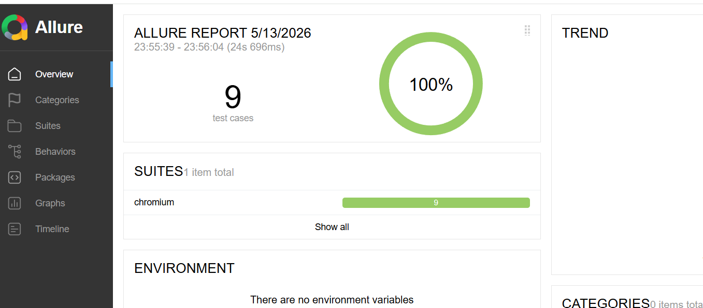

# Playwright Automation Framework

## Overview

This project is a Playwright automation framework built with JavaScript.

The framework covers:

- UI Automation Testing
- API Automation Testing
- Page Object Model (POM)
- Data-Driven Testing
- Parallel Execution
- HTML Reporting
- Allure Reporting

---

## Tech Stack

- Playwright
- JavaScript
- Node.js
- Allure Report

---

## Project Structure

```text
pages/
testData/
tests/
  ├── api/
  └── ui/
```

---

## Install Dependencies

```bash
npm install
```

---

## Run All Tests

```bash
npx playwright test
```

---

## Run UI Tests

```bash
npx playwright test tests/ui
```

---

## Run API Tests

```bash
npx playwright test tests/api
```

---

## Open Playwright HTML Report

```bash
npx playwright show-report
```

---

## Generate Allure Report

```bash
allure generate allure-results --clean -o allure-report
```

---

## Open Allure Report

```bash
allure open allure-report
```
## Allure Report



## Jenkins CI/CD Integration

This framework is integrated with Jenkins using GitHub Webhooks and ngrok for automated CI execution.

Workflow: GitHub Push → Webhook Trigger → ngrok Tunnel → Jenkins → Playwright Test Execution

Features:
- Automated Jenkins builds on GitHub push
- GitHub webhook integration
- ngrok public tunnel for local Jenkins exposure
- Headless Playwright execution in CI
- HTML and Allure reporting
